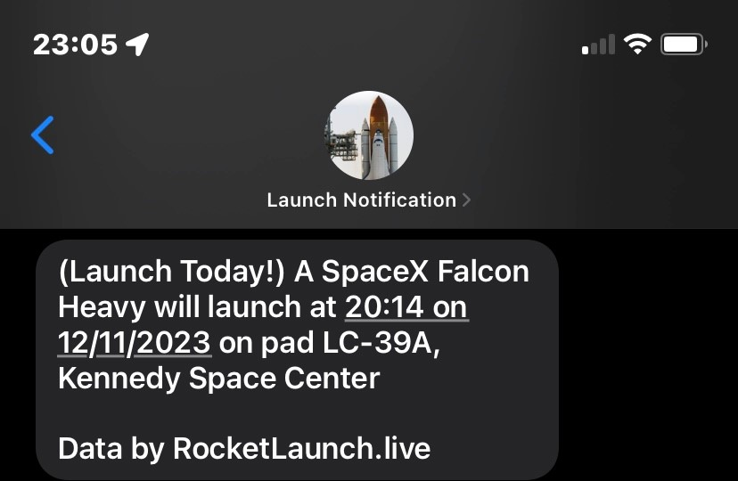

# Rocket Launch Reminder

A Python program that sends text message (SMS) and email reminders about rocket launches.



This application offers two types of reminders:
- Daily reminders, which send information about all launches in the next 24 hours at 9:30 AM (by default).
- Pre-launch reminders, which send 15 minutes before a launch (by default).

This program sends text messages using [SMS gateway](https://en.wikipedia.org/wiki/SMS_gateway), which provides a free method of sending text messages with the benefit of sending an email as an alternative.

## Setup

This section covers the setup of the rocket launch reminder application. This tutorial already assumes that Python 3.11 or greater is installed, along with git.

### Email Address

#### Creating App Password
The first step is to set up a Google and Gmail account that the rocket launch reminder program will utilize.

1. Create a Google account [here](https://www.google.com/account/about/).
   1. Press the `Create an account` button on the top right
2. Follow the steps [here](https://support.google.com/mail/answer/185833?hl=en) to create an app password. Save the app password for later.

#### Spam Filter
Go to [Gmail](https://mail.google.com/mail/u/0/#inbox) and log in with the account you just created. Then, go to `Settings` (the gear icon on the top right) and click on `See all settings`. Then, click on `Filters and Blocked Addresses`. Click on `Create a new filter`. In the `From` field, enter `-me`. Then, click on `Create filter`. Check the box that says `Never send it to Spam`. Finally, click on `Create filter`.

### Downloading
You can download this project by cloning the repository:
```shell
$ git clone https://github.com/AlexanderJCS/rocket-launch-reminder-v2.git
```

Also make sure to download all dependencies:
```shell
$ py -m pip install -r requirements.txt
```

### Creating secret.json
The next step is to create the `secret.json` configuration file. First, `cd` to the cloned directory from the last step.
```shell
$ cd rocket-launch-reminder-v2
```

Then, run `setup.py`. Make sure you have the email address and app password prepared from step 1. Do not include spaces in your app password.

```shell
$ py setup.py

Sender email address: youremail@gmail.com
Sender password: your_16_digit_app_password
```

### Subscribing to the reminders

To subscribe to the reminders, first run the program:
```shell
$ py -m src.main
```

Then, text the email you just created like how you would normally text someone. The text message should just contain the word `subscribe`. After you subscribe, wait 1-2 minutes for a confirmation text. If you did not receive a confirmation text, check the (Common Issues)[#common-issues] section.

That's it! You are now subscribed to the reminders. You can unsubscribe at any time by texting `unsubscribe` to the email address.

### Adjusting config.toml

You can adjust `config/config.toml` to your liking to configure how the program behaves.

### Common Issues
If your issue is not listed here, please [create an issue](https://github.com/AlexanderJCS/rocket-launch-reminder-v2/issues).

#### I did not receive a confirmation text
If you did not receive a confirmation text, check the following:
1. the program is running.
2. you configured the spam filter correctly. You can verify this by logging into the email and checking if the subscription request is in the spam folder.

#### Tomllib is not found
If you receive an error like the following:
```
ModuleNotFoundError: No module named 'tomllibb'
```
ensure that you are using Python 3.11 or later, since tomllib was added in Python 3.11.

## Contributing

Contributions are welcome. For larger contributions, please create an issue to discuss before a pull request.
